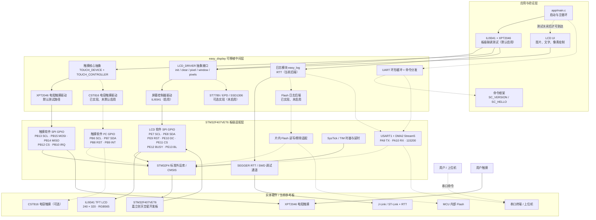
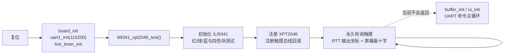

# easy_display 当前架构图

日期：2026-08-09  
阶段：现有设计复盘（快速模式）

> 本图依据当前仓库代码与配置生成。实线表示当前默认启用或实际调用路径；虚线表示代码已具备、但当前默认配置未启用或在默认启动流程中不可达的能力。

## 1. 系统总览

## 2. 当前默认启动路径

## 3. 当前设计结论

- 核心设计思想是“上层统一 API + 控制器驱动 + 板级回调适配”。显示和触摸控制器不直接绑定 STM32 外设，移植时主要替换 `mcu_spi`、`mcu_touch_spi`、`mcu_touch_iic` 等板级实现。
- 当前实际生效组合是 `STM32F407VET6 + ILI9341 240×320 + XPT2046 + SEGGER RTT`。
- LCD 与 XPT2046 分别使用一套软件 SPI GPIO，没有共享同一 SPI 总线。
- CST816 的驱动和软件 I²C 适配已经存在，但默认校准测试关闭；ST7789、EPD、SSD1306 也属于可选能力，当前配置未启用。
- UART1 DMA 环形接收、命令框架和普通 UI 主循环已经实现，但默认开启的 ILI9341/XPT2046 测试含永久循环，因此这些代码在当前固件启动路径中不可达。
- 日志框架支持 RTT、UART 和片内 Flash；当前 `DEBUG_TARGETS` 只启用 RTT。Flash 日志配置和底层读写代码存在，但不是当前运行后端。

## 4. 需要后续确认的边界

- 仓库没有完整原理图或电源设计资料，因此电源输入、稳压、电平兼容、ESD/EMI、连接器和背光驱动电流不在本图中推断。
- `PE12 BUSY` 是通用显示适配保留信号；ILI9341 常规 SPI 显示路径是否实际接入该脚，需要以接线或原理图确认。
- 当前架构更接近“裸机轮询 + 中间件回调”，尚未看到 RTOS 任务、事件队列或统一显示/触摸事件循环。
- 显示总线为 GPIO 模拟 SPI，适合联调和移植验证；刷新带宽是否满足最终 GUI，需要用目标帧率和局部刷新比例实测。

## 5. 主要证据文件

- `driver_pack/user_conf.h`：当前板级依赖及测试开关。
- `driver_pack/lcd/inc/lcd_conf.h`：ILI9341、分辨率和显示接口配置。
- `driver_pack/lcd/inc/lcd_driver.h`：LCD 抽象接口。
- `driver_pack/input/touch/core/inc/touch_driver.h`：触摸设备、总线和控制器抽象。
- `demo/stm32_f4/example_pro/app/main.c`：实际启动顺序。
- `tests/target/touch/ili9341_xpt2046_test.c`：默认板级测试及永久轮询路径。
- `demo/stm32_f4/example_pro/board/`：LCD、触摸、Flash 与时基适配。
- `demo/stm32_f4/example_pro/bsp/uart/`：USART1 + DMA 环形接收。
- `driver_pack/log/inc/sc_log_conf.h`：当前 RTT 日志后端选择。
